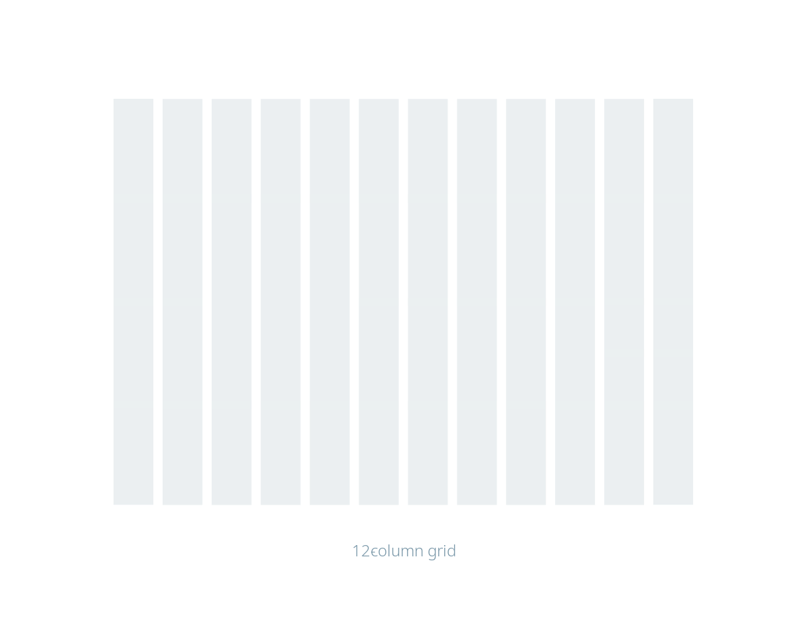
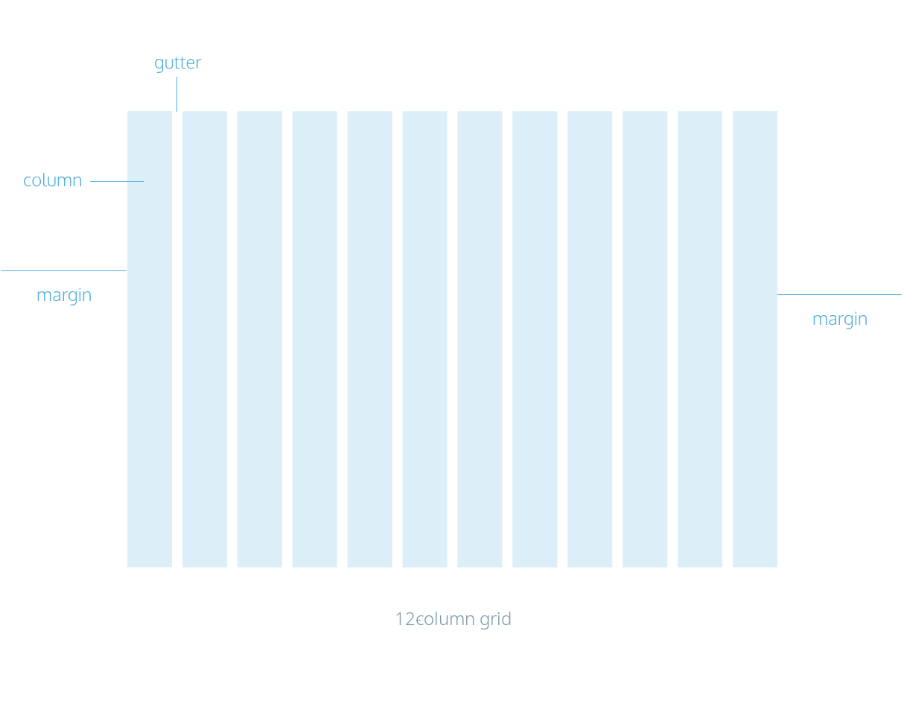

- The **CSS** or *Cascading Style Sheets* is a **Styling Language** (unlike [[Programming Language]] or [[Markup Language]] ) Which let you style any [[HTML]] files
- # Responsive Design
	- **Responsive Design** is the design system that make your HTML document looks good in many device (for clear, it's make your site appear different depends on what *Screen Size* it's rendering)
	- ## Grid System
	  id:: 66e657a8-897d-444c-af3a-943384c9f104
		- Grid System is a design like this pictures
		  
		  You can display your content in your page just like in the image above using ((66e657a8-897d-444c-af3a-943384c9f104))
		- ### Grid Anatomy
			- In Grid Anatomy, it has 3 things
				- **Column**
				  logseq.order-list-type:: number
				  id:: 66e65a97-9272-4705-83cf-2f82c7401f56
					- Column in  ((66e657a8-897d-444c-af3a-943384c9f104)) is *Vertical Section* that shows how *many* it is and how *wide* it is
					- Usually, In many design it contain 3, 4, 12, 16 section of column depends on screen size and the content on the webpage
				- **Gutter**
				  logseq.order-list-type:: number
					- Gutter in ((66e657a8-897d-444c-af3a-943384c9f104)) is a *blank space* between each ((66e65a97-9272-4705-83cf-2f82c7401f56))
					  logseq.order-list-type:: number
					- Usually it's just a blank space and focus to ensure that column don't
					  logseq.order-list-type:: number
				- **margin** :
				  logseq.order-list-type:: number
			- 
			-