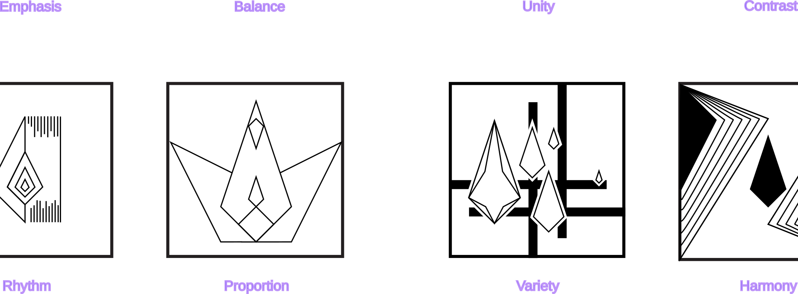

type:: [[Creative Creation]] 
facalty::  [[Mass Communication Technology]]

- # Creative and Design
	- สิ่งจำเป็นในการทำ Design มี 3 อย่าง คือ
	  collapsed:: true
		- Big Idea
		  logseq.order-list-type:: number
		- Brain Storm
		  logseq.order-list-type:: number
		- Think Different
		  logseq.order-list-type:: number
		- Be Creative
		  logseq.order-list-type:: number
	- นิยามของความคิดสร้างสรรค์
	  collapsed:: true
		- ความคิดแนวตั้ง (Vertical)
		  collapsed:: true
			- ลำดับวิธีการคิด ไม่ตัดวิธีการออก
		- ความคิดแนวข้าง (Lateral)
		  collapsed:: true
			- หาวิธีคิดใหม่ ตัดวิธีคิดที่ไม่จำเป็นออก
		- ความคิดแบบขนาน (Parallel)
		  collapsed:: true
			- ใส่ใจทุกความคิด ไม่มีความคิดไหนที่ผิดหรือถูก
		- เทคนิคการคิดสร้างสรรค์
		  collapsed:: true
			- เทคนิคความคิดแบบเอกนัยหรือแบบกระจาย (Divergent Thinking)
			  collapsed:: true
				- ริเริ่ม (Originality)
				  collapsed:: true
					- แปลกใหม่ แตกต่างไปจากสิ่งที่คุ้นเคย ไม่เคยประกฎมาก่อน
				- คล่องแคล่ว (Fluency)
				  collapsed:: true
					- แตกต่างและหลากหลายภายใต้กรอบจำกัดเวลา มีประสิทธิภาพ
				- ยืดหยุ่น (Flexibility)
				  collapsed:: true
					- มีความนอกกรอบ ไม่อยู่ในกฎเกณฑ์เดิมๆ มีหลายทางเลือก
				- ละเอียดละออ (Elaboration)
				  collapsed:: true
					- มีความครบถ้วน สมบูรณ์ ไม่ละเลยในรายละเอียดเล็กๆ น้อยๆ
			- เทคนิคการคิดแบบขนาน หรือ แบบหมวก 6 ใบ
			  collapsed:: true
				- หมวกขาว | กลาง
				- หมวกแดง | โกรธ
				- หมวกดำ | จริงจัง
				- หมวกเหลือง | มองบวก
				- หมวกเขียว | ริเริ่ม
				- หมวกฟ้า | -
	- องค์ประกอบของความคิดสร้างสรรค์
	  collapsed:: true
		- แรงจูงใจ (Motivation)
		- ทักษะความคิดสร้างสรรค์ (Creative thinking skill)
		- ประสบการณ์ (Expertise)
		- [[draws/2024-08-28-11-06-21.excalidraw]]
		- TODO เพิ่มภาพและความหมาย
		- TODO เพิ่มบุคลิกของกราฟฟิก
	- แนวคิดและคอนเซปต์
	  background-color:: yellow
		- การเน้น (**Emphasis**)
			- การกระทำให้เด่นเป็นพิเศษกว่าธรรมดา ด้วย องค์ประกอบ แยกส่วน หรือ การเน้นด้วยการจัดวางตำแหน่ง ซึ่งมีจุดหลัก จุดรอง
		- ความสมดุล (**Balancing**)
			- ความสมดุล ที่จะเป็นแบบเท่ากันหรือไม่เท่ากันก็ได้
		- ความเป็นหนึ่ง (**Unity**)
			- ความเป็นกลุ่มก้อน มีความเป็นกลุ่มก้อน มีความสัมพันธ์ต่อกัน
		- ความแตกต่าง (**Contrast**)
			- สิ่งที่แสดงถึงความแตกต่าง ให้มีความน่าสนใจ แสดงถึงความเคลื่อนไหว มีมิติ ด้วยขนาด รูปร่าง สี อื่นๆ
		- จังหวะ (**Rhythm**)
			- การจัดวางสิ่งที่มีความสัมพันธ์ในตัวเอง มีจังหวะ ระยะห่างที่แสดงออก
		- สัดส่วน (**Proportion**)
			- ความสัมพันธ์ของส่วนต่างๆในตัวของวัตถุเอง และความสัมพันธ์เมื่อเทียบเคียงกับวัตถุอื่น คำนึงถึงความสัมพันธ์และเหมาะสมกับรูปร่างนั้นๆ ด้วยสถานที่เวลา
		- ความหลากหลาย (**Variety**)
			- การจัดลักษณะที่แตกต่างกัน แต่มีธรรมชาติจุดเชื่อมเดียวกัน
		- ความกลมกลืน (**Harmony**)
			- การจัดรูปแบบที่มีความเป็นทิศทางเดียวกัน ลื่นไหล การประสานเข้าสนิทกัน กลมกลืน ปรองดอง สามัคคี ลงรอย แบบการรวมกันของสิ่งที่นำเสนอ
		- 
- # Gestalt Principles
	- Gestalt Principles หลักการของเกสตัลต์ คือ **หลักการของรูปทรง**
		- เหมาะกับกรณีเมื่อเราต้องการบอกว่าองค์ประกอบไหนบ้างเป็นสิ่งสำคัญที่เราต้องการแสดงเพื่อสื่อสาร หรือองค์ประกอบไหนไม่สำคัญ
			- Gestalt Psychology
				- เป็นทฤษฎีจิตใจและสมองของสำนักจิตวิทยาเชิงการทดลอง หลักการของจิตวิทยาเกสตัลล์ คือ สมองเป็นแบบองค์รวม หลักการมีอยู่ว่า ตามนุษย์เห็นทั้งหมดก่อนค่อยรับรู้องค์ประกอบย่อ
				  Analog หมายถึง วิธีการเก็บข้อมูลที่ได้จากการวัดในลักษณะต่อเนื่อง
				  องค์ประกอบดังนี้
					- **proximity** ความใกล้ชิด
					  logseq.order-list-type:: number
						- มนุษย์จะคิดว่าวัตถุอะไรที่นำเสนอตำแหน่งที่ใกล้กัน จะเป็นวัตถุกลุ่มเดียวกัน
					- **Similarly** ความคล้าย/เหมือนกัน
					  logseq.order-list-type:: number
						- วัตถุที่มี สี รูปร่าง ขนาด หรือตำแหน่งการวาง เหมือนกัน จะถูกมองว่าเกี่ยวข้องหรือเป็นวัตถุกลุ่มเดียวกัน
					- **Enclosure** การตีกรอบ
					  logseq.order-list-type:: number
						- เรามักจะคิดว่าวัตถุที่ถูกล้อมกรอบไว้ด้วยกันจะเป็นกลุ่มเดียวกัน แต่ไม่จำเป็นต้องตีกรอบเสมอไป สามารถใช้การแรงเงาพื้นหลังก็เพียงพอ
					- **Closure** การปิด/สิ้นสุด/ยุติ
					  logseq.order-list-type:: number
						- แนวคิดคือคนชอบอะไรที่ดูเรียบง่ายและเหมาะสมพอดี ผู้คนมักจะมองว่าองค์ประกอบของแต่ละอย่างเป็นรูปร่างเดียว ซึ่งอยู่ในแบบที่เราจดจำมา เมื่อบางส่วนหายไป ดวงตาจะเติมเต็มช่องว่างเองหลักการ การปิด ระบุว่าเมื่อเราดูภาพที่ซับซ้อน เรามักจะมองหารูปแบบเดียวที่สามารถจดจำได้ เมื่อเห็นภาพที่ขาดไปสมองจะ เติมเต็มให้
					- **Continuity** ความต่อเนื่อง
					  logseq.order-list-type:: number
						- หลักการความต่อเนื่องคล้ายกับหลักการปิด เมื่อมองไปที่วัตถุ ดวงตาจะหาเส้นที่ราบเรียบที่สุดและสร้างความต่อเนื่องให้กับสิ่งที่เราเห็นโดยธรรมชาติ แม้ว่าสิ่งน้ำจะไม่มีอยู่จริง
					- **Connection** การเชื่อมต่อ
					  logseq.order-list-type:: number
						- ภาพหรือวัถุที่มีความเชื่อมต่อกัน จะถูกมองว่าเป็นกลุ่มเดียวกัน 
						  หลักการของเกสตัลต์ ช่วยนำไปออกแบบในหลายด้าน เช่น
							- การออกแบบ UI
							  logseq.order-list-type:: number
							- การขจัดความยุ่งยากในการนำเสนอ
							  logseq.order-list-type:: number
							- การทำ Infographic
							  logseq.order-list-type:: number
							- *อื่นๆ*
							  logseq.order-list-type:: number
- # Creative Thinking
	- ## Creative
		- คือ กระบวนการที่มีการคิด **สิ่งใหม่** ขึ้นมา โดยอาจจะเกิดขึ้นจากการที่**ตั้งใจหรือไม่ตั้งใจ**ก็ได้
	- ## Creative Thinking?
		- คือ การคิดที่พยายามหาทางออกหลายๆ ทาง ใช้ความคิดที่หลากหลาย นอกกรอบ และปรับปรุงให้ดีขึ้นเรื่อยๆ
		- ขั้นตอนของการคิดอย่างสร้างสรรค์ มี 6 ขึ้นตอน
			- แสวงหาข้อบกพร่อง (Mess Finding)
			  logseq.order-list-type:: number
			- รวบรวมข้อมูล (Data Finding)
			  logseq.order-list-type:: number
			- มองปัญหาทุกด้าน (Problem Finding)
			  logseq.order-list-type:: number
			- แสวงหาความคิดที่หลากหลาย (Idea Finding)
			  logseq.order-list-type:: number
			- หาคำตอบรอบด้าน (Solution Finding)
			  logseq.order-list-type:: number
			- หาข้อสรุปที่เหมาะสม (Acceptance Finding)
			  logseq.order-list-type:: number
		- ความหมายของ Creative Thinking มี 3 ประเด็น
			- คิดในแง่บวก (Positive Thinking)
			  logseq.order-list-type:: number
			- เป็นความคิดที่ไม่ทำร้ายใคร (Constructive Thinking)
			  logseq.order-list-type:: number
			- เป็นการสร้างสรรค์สิ่งใหม่ (Creative Thinking)
			  logseq.order-list-type:: number
		- ความคิดสร้างสรรค์เกิดขึ้นได้ 2 ทาง
			- **เริ่มจากจินตนาการ แล้วย้อนสู่ความจริง**
			  logseq.order-list-type:: number
			- **เริ่มจากความรู้ที่มี แล้วต่อยอดสู่สิ่งใหม่** ส่วนใหญ่จะเรียกว่า **นวัตกรรม**
			  logseq.order-list-type:: number
		- กระบวนการความคิดสร้างสรรค์
			- **เกิดสิ่งกระทบให้รู้สึกว่า** ***ต้องคิด***
			  logseq.order-list-type:: number
				- เกิดเหตุที่ทำให้รู้สึกต้องใช้ความคิดแก้ปัญหาอะไรสักอย่าง
			- **รวบรวมข้อมูล**
			  logseq.order-list-type:: number
			  id:: 66cfdb6b-f8bc-4048-a640-b71ea97ff348
				- เก็บข้อมูลและประเด็นที่เกี่ยวข้องในทุกแง่มุม
			- **แจกแจง**
			  logseq.order-list-type:: number
			  id:: 66cfdb77-ea44-483c-bce1-f8137bfb44e6
				- นำข้อมูลที่ได้มาจาก ((66cfdb6b-f8bc-4048-a640-b71ea97ff348)) มาทำความสะอาด จัดเรียง และวิเคราะห์เพื่อให้นำไปใช้ต้อได้
			- **คิดและกระทำให้ชัดเจน**
			  logseq.order-list-type:: number
				- นำข้อมูลที่ได้มาจาก ((66cfdb77-ea44-483c-bce1-f8137bfb44e6)) มาทำให้เห็นภาพ ขั้นตอน โดยข้อมูลจะต้องชัดดเจน
			- **แสดงออก**
			  logseq.order-list-type:: number
				- พิสูจน์ ทดลอง ทดสอบ และนำเสนอ
		-
	-