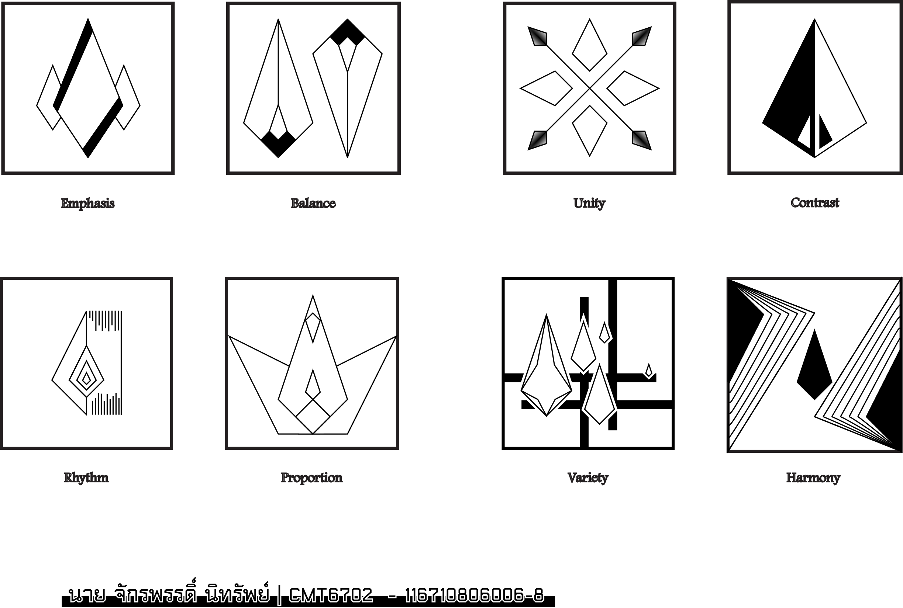

-
- # Creative and Design
	- สิ่งจำเป็นในการทำ Design มี 3 อย่าง คือ
		- Big Idea
		  logseq.order-list-type:: number
		- Brain Storm
		  logseq.order-list-type:: number
		- Think Different
		  logseq.order-list-type:: number
		- Be Creative
		  logseq.order-list-type:: number
	- นิยามของความคิดสร้างสรรค์
		- ความคิดแนวตั้ง (Vertical)
			- ลำดับวิธีการคิด ไม่ตัดวิธีการออก
		- ความคิดแนวข้าง (Lateral)
			- หาวิธีคิดใหม่ ตัดวิธีคิดที่ไม่จำเป็นออก
		- ความคิดแบบขนาน (Parallel)
			- ใส่ใจทุกความคิด ไม่มีความคิดไหนที่ผิดหรือถูก
		- เทคนิคการคิดสร้างสรรค์
			- เทคนิคความคิดแบบเอกนัยหรือแบบกระจาย (Divergent Thinking)
				- ริเริ่ม (Originality)
					- แปลกใหม่ แตกต่างไปจากสิ่งที่คุ้นเคย ไม่เคยประกฎมาก่อน
				- คล่องแคล่ว (Fluency)
					- แตกต่างและหลากหลายภายใต้กรอบจำกัดเวลา มีประสิทธิภาพ
				- ยืดหยุ่น (Flexibility)
					- มีความนอกกรอบ ไม่อยู่ในกฎเกณฑ์เดิมๆ มีหลายทางเลือก
				- ละเอียดละออ (Elaboration)
					- มีความครบถ้วน สมบูรณ์ ไม่ละเลยในรายละเอียดเล็กๆ น้อยๆ
			- เทคนิคการคิดแบบขนาน หรือ แบบหมวก 6 ใบ
				- หมวกขาว | กลาง
				- หมวกแดง | โกรธ
				- หมวกดำ | จริงจัง
				- หมวกเหลือง | มองบวก
				- หมวกเขียว | ริเริ่ม
				- หมวกฟ้า | -
	- องค์ประกอบของความคิดสร้างสรรค์
		- แรงจูงใจ (Motivation)
		- ทักษะความคิดสร้างสรรค์ (Creative thinking skill)
		- ประสบการณ์ (Expertise)
		- [[draws/2024-08-28-11-06-21.excalidraw]]
		- TODO เพิ่มภาพและความหมาย
		- TODO เพิ่มบุคลิกของกราฟฟิก
	- แนงวคิดและคอนเซปต์
		- การเน้น (Emphasis)
			- การกระทำให้เด่นเป็นพิเศษกว่าธรรมดา ด้วย องค์ประกอบ แยกส่วน หรือ การเน้นด้วยการจัดวางตำแหน่ง ซึ่งมีจุดหลัก จุดรอง
		- ความสมดุล (Balancing)
			- ความสมดุล ที่จะเป็นแบบเท่ากันหรือไม่เท่ากันก็ได้
		- ความเป็นหนึ่ง (Unity)
			- ความเป็นกลุ่มก้อน มีความเป็นกลุ่มก้อน มีความสัมพันธ์ต่อกัน
		- ความแตกต่าง (Contrast)
			- สิ่งที่แสดงถึงความแตกต่าง ให้มีความน่าสนใจ แสดงถึงความเคลื่อนไหว มีมิติ ด้วยขนาด รูปร่าง สี อื่นๆ
		- จังหวะ (Rhythm)
			- การจัดวางสิ่งที่มีความสัมพันธ์ในตัวเอง มีจังหวะ ระยะห่างที่แสดงออก
		- สัดส่วน (Proportion)
			- ความสัมพันธ์ของส่วนต่างๆในตัวของวัตถุเอง และความสัมพันธ์เมื่อเทียบเคียงกับวัตถุอื่น คำนึงถึงความสัมพันธ์และเหมาะสมกับรูปร่างนั้นๆ ด้วยสถานที่เวลา
		- ความหลากหลาย (Variety)
			- การจัดลักษณะที่แตกต่างกัน แต่มีธรรมชาติจุดเชื่อมเดียวกัน
		- ความกลมกลืน (Harmony)
			- การจัดรูปแบบที่มีความเป็นทิศทางเดียวกัน ลื่นไหล การประสานเข้าสนิทกัน กลมกลืน ปรองดอง สามัคคี ลงรอย แบบการรวมกันของสิ่งที่นำเสนอ
		- 
		-
	-